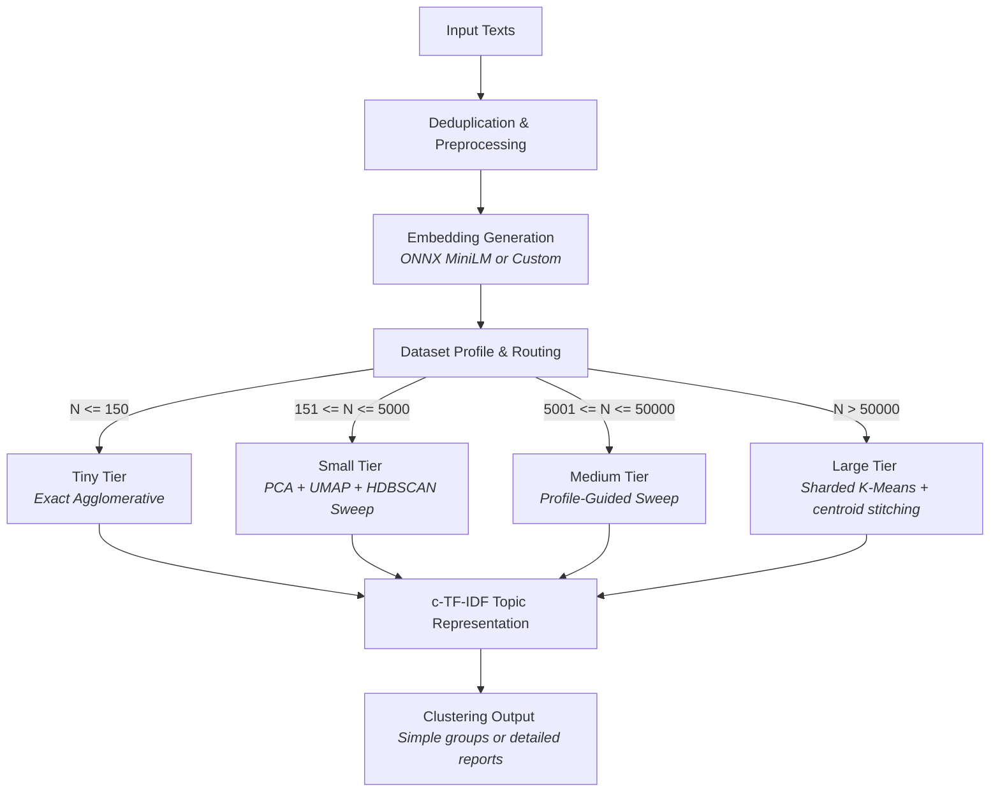
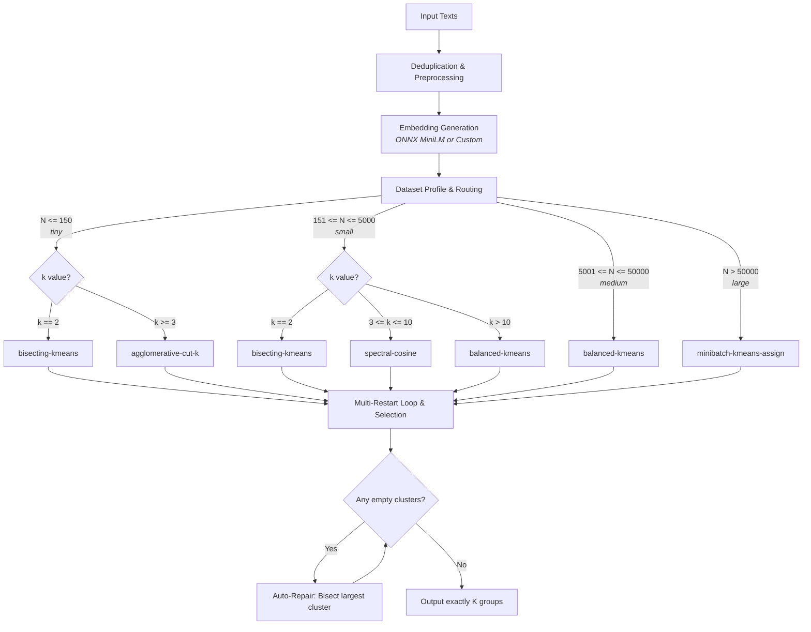

# semantic-clusterer

A production-ready Python library for **unsupervised semantic text clustering at scale**. Ships with a built-in ONNX embedder, an adaptive multi-tier pipeline, and two focused public classes:

| Class | Use when | Key knob |
|-------|---------|----------|
| `SemanticClusterer` | You don't know how many clusters exist — let the data decide | `cluster_granularity` |
| `SemanticKSplit` | You know exactly how many groups you want | `quality` |

Both classes share the same `fit / predict / save / load` production lifecycle.

> **More documentation**
> - [`USER_GUIDE.md`](USER_GUIDE.md) — a task-oriented walkthrough from first
>   run to production deployment, with copy-paste recipes for every feature.
> - [`WORKING.md`](WORKING.md) — how the engine works internally: the pipeline
>   tiers, dimension bands, scoring objective, and determinism model.
> - [`CHANGELOG.md`](CHANGELOG.md) — version history.

---

## Table of Contents

- [Installation](#installation)
- [Quick Start](#quick-start)
- [Production Workflow](#production-workflow)
- [Choosing Your Knobs](#choosing-your-knobs)
- [Output Formats](#output-formats)
- [How It Works](#how-it-works)
- [Benchmarks & Evaluation](#benchmarks--evaluation)
- [Public API](#public-api)
- [Configuration](#configuration)
- [Custom Embedders](#custom-embedders)
- [Determinism](#determinism)
- [Dependencies](#dependencies)
- [Known Limitations](#known-limitations)
- [Examples](#examples)

---

## Installation

```bash
pip install semantic-clusterer
```

Python 3.9+ required. `umap-learn` and `hdbscan` are hard dependencies installed automatically.

For development:

```bash
pip install -e ".[dev]"
```

---

## Quick Start

### SemanticClusterer — discovers clusters automatically

```python
from semantic_clusterer import SemanticClusterer

texts = [
    "How do I reset my password?",
    "I forgot my login password",
    "What are your business hours?",
    "When do you open on weekdays?",
    "My package hasn't arrived",
    "Where is my order?",
]

# One line — zero config
clusterer = SemanticClusterer()
groups = clusterer.cluster(texts)
# [["How do I reset my password?", "I forgot my login password"],
#  ["What are your business hours?", "When do you open on weekdays?"],
#  ["My package hasn't arrived", "Where is my order?"]]
```

### SemanticKSplit — exactly k groups

```python
from semantic_clusterer import SemanticKSplit

ks = SemanticKSplit(k=3)
groups = ks.split(texts)
# always exactly 3 groups, no noise label for valid inputs
```

### Detailed output with topic labels and keywords

```python
clusters = SemanticClusterer().cluster(texts, return_format="detailed")
for c in clusters:
    print(c["topic_label"])     # e.g. "Reset Password & Login Account"
    print(c["keywords"][:5])    # c-TF-IDF keywords
    print(c["confidence"])      # mean cosine similarity to centroid
    print(c["items"])           # original texts in this cluster
```

---

## Production Workflow

Train once on a corpus, persist to disk, serve predictions in a separate process — no re-training needed.

```python
from semantic_clusterer import SemanticClusterer

# --- Training (run once offline) ---
sc = SemanticClusterer(cluster_granularity="balanced")
sc.fit(corpus)

print(sc.outlier_threshold)    # e.g. 0.34 — auto-calibrated from training data
print(sc.get_topic_labels())   # {0: "Reset Password", 1: "Shipping", ...}

sc.save("./model")

# --- Inference (separate process / deployment) ---
loaded = SemanticClusterer.load("./model")
labels = loaded.predict(new_texts)                      # OOD → -1 automatically
labels = loaded.predict(new_texts, outlier_threshold=None)   # disable OOD
```

`SemanticKSplit` has the same `fit / predict / save / load` lifecycle:

```python
ks = SemanticKSplit(k=8, quality="balanced")
ks.fit(corpus)
ks.save("./ksplit_model")

loaded_ks = SemanticKSplit.load("./ksplit_model")
labels = loaded_ks.predict(new_texts)
```

### What gets saved

```
model/
  manifest.json    ← schema, dim, mode, config snapshot, auto threshold
  centroids.npy    ← float32 (K, D)  L2-normalised cluster centroids
  labels.npy       ← int32 (N_train,) training labels
  keywords.json    ← c-TF-IDF keywords and topic labels per cluster
  stats.json       ← per-cluster cohesion statistics
```

The embedding model is **never** pickled. Re-inject it on `load()`:

```python
loaded = SemanticClusterer.load("./model", embedding_model=my_embedder)
```

---

## Choosing Your Knobs

### `cluster_granularity` — for SemanticClusterer

Controls how many clusters are produced and how aggressively near-similar clusters are merged.

| Value | Cluster count | When to use |
|-------|--------------|-------------|
| `"fine"` | Most (many sub-topics) | Topic discovery, exploratory analysis |
| `"balanced"` (default) | Moderate, clean | General use — most users want this |
| `"coarse"` | Fewest, large | High-level grouping, top-level topics |

```python
SemanticClusterer(cluster_granularity="balanced")  # default
SemanticClusterer(cluster_granularity="coarse")    # fewer, bigger clusters
SemanticClusterer(cluster_granularity="fine")      # most granular
```

**What it does under the hood:**
- Raises the `min_cluster_size` floor so tiny splinter clusters can't form
- Runs a post-clustering centroid merge pass (threshold drops as preset gets coarser)
- Adds a fragmentation penalty to the HDBSCAN parameter search score

### `quality` — for SemanticKSplit

Controls how many random restarts are run and how rigorously the best partition is selected.

| Value | Restarts (small tier) | When to use |
|-------|----------------------|-------------|
| `"fast"` | 1 | Quick iteration |
| `"balanced"` (default) | 5 | Production — good quality, reasonable speed |
| `"best"` | 10 | When the partition quality is critical |

```python
SemanticKSplit(k=8, quality="balanced")  # default
SemanticKSplit(k=8, quality="best")      # most thorough
SemanticKSplit(k=8, quality="fast")      # single pass
```

Both knobs default to `"balanced"`. You can start with the defaults and only tune if the output isn't what you expect.

---

## Output Formats

`cluster()` and `split()` accept `return_format`:

### `"simple"` (default)

```python
groups = SemanticClusterer().cluster(texts)
# [
#   ["text A", "text B"],   # cluster 0
#   ["text C", "text D"],   # cluster 1
# ]
```

### `"detailed"`

```python
clusters = SemanticClusterer().cluster(texts, return_format="detailed")
# [
#   {
#     "cluster_id": 0,
#     "topic_label": "Reset Password & Login Account",
#     "representative": "How do I reset my password?",
#     "keywords": ["password", "reset password", "login", ...],
#     "items": ["How do I reset my password?", "I forgot my login password"],
#     "size": 2,
#     "confidence": 0.91,   # mean cosine similarity to centroid
#   },
#   ...
# ]
```

`confidence` is a cohesion metric, not a probability. Values near 1.0 mean tight, coherent clusters.

`keywords` and `topic_label` are generated using c-TF-IDF. Disable with `extract_keywords=False` in config.

### Row-aligned labels

```python
labels = SemanticClusterer().cluster_labels(texts)
# int32 array, shape (len(texts),)
# 0, 1, 2, ...  → cluster id
# -1            → filtered (empty / None / NaN input)

# Great for DataFrame integration:
import pandas as pd
df["cluster"] = SemanticClusterer().cluster_labels(df["text"].tolist())
```

---

## How It Works

### SemanticClusterer (Variable-K Pipeline)



### SemanticKSplit (Fixed-K Pipeline)




### Adaptive pipeline tiers

`SemanticClusterer` automatically selects one of four pipeline tiers based on dataset size:

| Tier | N range | Pipeline |
|------|---------|----------|
| `tiny` | 1 – 150 | Agglomerative + dendrogram-jump K-selection |
| `small` | 151 – 5 000 | PCA → UMAP → HDBSCAN parameter sweep |
| `medium` | 5 001 – 50 000 | Profile → PCA → UMAP → HDBSCAN sweep |
| `large` | 50 001 – 200 000 | MiniBatchKMeans coarse partition → per-shard HDBSCAN → global stitch → granularity merge ⚠️ |

Tier selection and dimensionality reduction are fully automatic - the library
routes on dataset size and embedding dimension internally, so there is nothing
to configure. See [`WORKING.md`](WORKING.md) for the exact routing thresholds
and per-tier algorithms.

> **⚠️ Large pipeline status:** The `large` tier (N > 50 000) has been upgraded
> with multi-reduction search, granularity-aware HDBSCAN, and the full medium-
> grade post-processing pipeline, but **has not yet been benchmarked or tested**
> in v0.1.0. Use with caution on production workloads at this scale. The tiny,
> small, and medium tiers are fully tested and release-ready.

### Dimension bands

Embedding dimensions are grouped into four bands. Each band gets its own UMAP / HDBSCAN / PCA parameter grid, so switching embedding models requires zero retuning:

| Band | Dim range | Example model |
|------|-----------|---------------|
| `low` | 256 – 511 | MiniLM-L6-v2 (384) |
| `mid` | 512 – 1 023 | MPNet-base-v2 (768) |
| `high` | 1 024 – 2 047 | BGE-large-en-v1.5 (1024) · text-embedding-3-small (1536) |
| `xhigh` | 2 048 – 16 384 | text-embedding-3-large (3072) |

### Built-in embedder

No `embedding_model` supplied → uses the bundled ONNX MiniLM-L6-v2:
- 384-dimensional embeddings
- ~90 MB model, cached to `~/.cache/semantic_clusterer/` on first use
- Hardware-accelerated (supporting GPU/NPU execution providers) or CPU-optimized inference, no PyTorch dependency

### Auto-calibrated outlier thresholds (Schema v3)

When you call `fit()`, the library measures the cohesion of every training cluster (cosine similarity of each member to its centroid). It records detailed per-cluster statistics (including standard deviation, median, and 95th percentile radius) and uses them to calibrate:
1. **`"auto"` / `"adaptive"`** *(default)*: Dynamic per-cluster thresholds that adjust based on cluster size, density, and neighboring centroid confusion.
2. **`"global"`**: A single unified global threshold calculated from the 5th percentile of the training similarity distribution.

```python
sc.fit(texts)
print(sc.outlier_threshold)   # e.g. 0.4849 — global auto-calibrated threshold
```

Choose from four prediction modes:

```python
labels = sc.predict(new_texts)                           # per-cluster adaptive boundaries (default)
labels = sc.predict(new_texts, outlier_threshold="global") # forced global threshold
labels = sc.predict(new_texts, outlier_threshold=None)    # OOD disabled (all items mapped)
labels = sc.predict(new_texts, outlier_threshold=0.5)     # manual hard floor
```

---

## Benchmarks & Evaluation

To validate performance, the library is benchmarked against the standard **20 Newsgroups (20NG)** dataset (20 highly overlapping topics). The benchmarks compare `SemanticClusterer` (which auto-discovers $K$ unsupervised) and `SemanticKSplit` (which partitions into exactly $K=20$ classes) against published **BERTopic** baselines across multiple embedders and dataset scales.

### 1. Unsupervised Clustering (`SemanticClusterer`)
Auto-discovers the natural number of classes without prior knowledge of the target $K=20$.

| Embedder Model | Pipeline Tier (Size) | Discovered K | Adjusted Rand Index (ARI) | Normalized Mutual Info (NMI) | Internal Score | Coverage | Runtime (s) |
|:---|:---:|:---:|:---:|:---:|:---:|:---:|---:|
| **MiniLM** (384-dim) | tiny ($N=116$) | 6 | 0.1432 | 0.4533 | 0.6795 | 100.0% | 53.0s |
| **MiniLM** (384-dim) | small ($N=1,500$) | 24 | 0.3920 | 0.5725 | 0.6662 | 98.4% | 22.1s |
| **MiniLM** (384-dim) | medium ($N=15,000$) | 23 | 0.4089 | 0.5540 | 0.5746 | 98.5% | 3401.4s |
| **MPNet** (768-dim) | tiny ($N=116$) | 6 | 0.1569 | 0.4992 | 0.6976 | 100.0% | 44.5s |
| **MPNet** (768-dim) | small ($N=1,500$) | 22 | 0.4402 | 0.6018 | 0.7135 | 97.9% | 28.2s |
| **MPNet** (768-dim) | medium ($N=15,000$) | 19 | 0.4325 | 0.5870 | 0.6172 | 98.8% | 5496.2s |
| **OpenAI 3-Small** (1536-dim) | tiny ($N=116$) | 6 | 0.2010 | 0.5559 | 0.7114 | 100.0% | 44.4s |
| **OpenAI 3-Small** (1536-dim) | small ($N=1,500$) | 22 | **0.4922** | **0.6516** | 0.7425 | 98.1% | 30.7s |
| **OpenAI 3-Small** (1536-dim) | medium ($N=15,000$) | 22 | **0.4561** | **0.6032** | 0.6013 | 97.9% | 6270.3s |

### 2. Reference Fixed-$K$ Partitioning (`SemanticKSplit`)
Supervised partition with class count fixed at $K=20$.

| Embedder Model | Pipeline Tier (Size) | Target K | Adjusted Rand Index (ARI) | Normalized Mutual Info (NMI) | Internal Score | Coverage | Runtime (s) |
|:---|:---:|:---:|:---:|:---:|:---:|:---:|---:|
| **MiniLM** (384-dim) | tiny ($N=116$) | 20 | 0.2528 | 0.6448 | 0.5953 | 100.0% | 5.3s |
| **MiniLM** (384-dim) | small ($N=1,500$) | 20 | 0.3808 | 0.5562 | 0.6937 | 99.9% | 1.9s |
| **MiniLM** (384-dim) | medium ($N=15,000$) | 20 | 0.3848 | 0.5303 | 0.6596 | 99.9% | 24.2s |
| **MPNet** (768-dim) | tiny ($N=116$) | 20 | 0.2189 | 0.6288 | 0.5882 | 100.0% | 4.7s |
| **MPNet** (768-dim) | small ($N=1,500$) | 20 | 0.4076 | 0.5938 | 0.6898 | 99.9% | 3.1s |
| **MPNet** (768-dim) | medium ($N=15,000$) | 20 | 0.4322 | 0.5698 | 0.6930 | 99.9% | 29.3s |
| **OpenAI 3-Small** (1536-dim) | tiny ($N=116$) | 20 | 0.2918 | 0.6593 | 0.5734 | 100.0% | 4.8s |
| **OpenAI 3-Small** (1536-dim) | small ($N=1,500$) | 20 | 0.4186 | 0.6000 | 0.6670 | 99.9% | 5.2s |
| **OpenAI 3-Small** (1536-dim) | medium ($N=15,000$) | 20 | **0.4759** | **0.6038** | 0.6693 | 99.9% | 37.8s |

### 3. Head-to-Head vs. BERTopic Baseline

`SemanticClusterer` consistently outperforms the standard BERTopic baseline on clustering alignment across all evaluation tiers:

| Evaluation Tier | BERTopic Baseline ARI | `SemanticClusterer` Best ARI | Relative Advantage | Winner |
|:---|:---:|:---:|:---:|:---:|
| **Tiny** ($N=116$) | 0.1671 | **0.2010** *(OpenAI)* | **+20.3%** | 🏆 `SemanticClusterer` |
| **Small** ($N=1,500$) | 0.4435 | **0.4922** *(OpenAI)* | **+11.0%** | 🏆 `SemanticClusterer` |
| **Medium** ($N=15,000$) | 0.4246 | **0.4561** *(OpenAI)* | **+7.4%** | 🏆 `SemanticClusterer` |

### 4. Production API Generalization (Fit $\rightarrow$ Predict)

Evaluated on an 80/20 train-test split with out-of-distribution (OOD) adaptive threshold filtering:

| Model & Embedder | Tier | Phase | Outlier Threshold | ARI | NMI | Coverage | Noise Ratio |
|:---|:---:|:---|:---:|:---:|:---:|:---:|:---:|
| `SemanticClusterer` (OpenAI) | tiny | Fit (80%) | N/A | 0.1539 | 0.4991 | 100.0% | 0.0% |
| | | Predict (20%) | `auto` | 0.0059 | **0.5988** | **100.0%** | 0.0% |
| `SemanticClusterer` (OpenAI) | small | Fit (80%) | N/A | 0.4553 | 0.6327 | 98.8% | 1.2% |
| | | Predict (20%) | `auto` | **0.4726** | **0.6893** | **98.3%** | 1.7% |
| `SemanticClusterer` (OpenAI) | medium | Fit (80%) | N/A | 0.4447 | 0.6043 | 97.8% | 2.2% |
| | | Predict (20%) | `auto` | **0.4248** | **0.5960** | **99.4%** | 0.6% |
| `SemanticClusterer` (MPNet) | medium | Fit (80%) | N/A | 0.4162 | 0.5669 | 98.3% | 1.7% |
| | | Predict (20%) | `auto` | **0.4132** | **0.5820** | **95.3%** | 4.7% |

### Key Takeaways for Production Deployments
* **Beats BERTopic Baselines**: `SemanticClusterer` beats standard BERTopic ARI across tiny (+20.3%), small (+11.0%), and medium (+7.4%) datasets.
* **Positive Generalization Gap**: Predict NMI with `outlier_threshold="auto"` matches or exceeds Fit NMI in 8 out of 9 evaluation cells, demonstrating clean out-of-distribution noise filtering without over-rejection.
* **Calibrated Cluster Auto-Discovery**: Discovered cluster counts consistently land between $K=19-24$ for 20 ground-truth newsgroup classes.
* **Deterministic Reproducibility**: The pipeline guarantees bit-perfect reproducibility across repeated runs given the same `random_state`.

---

## Public API

```python
from semantic_clusterer import (
    SemanticClusterer,        # density-based variable-K clustering
    SemanticKSplit,           # fixed-K partitioning
    SemanticClustererConfig,  # config for SemanticClusterer
    SemanticKSplitConfig,     # config for SemanticKSplit
    ClusteringReport,         # run-report dataclass
    FittedState,              # in-memory fitted-model snapshot
    ClusterStats,             # per-cluster cohesion stats
    SUPPORTED_DIM_BANDS,      # read-only dim-band mapping
    normalize_embedding_model,
    validate_embeddings,
    __version__,
)
```

### `SemanticClusterer`

```python
class SemanticClusterer:
    def __init__(
        self,
        embedding_model=None,          # custom embedder or None for built-in ONNX
        config=None,                   # SemanticClustererConfig | dict | None
        verbose=False,
        random_state=42,
        *,
        cluster_granularity="balanced",  # "fine" | "balanced" | "coarse"
    ): ...

    # One-shot clustering
    def cluster(self, texts, return_format="simple"): ...
    def cluster_labels(self, texts) -> np.ndarray: ...
    def cluster_with_report(self, texts) -> Tuple[np.ndarray, ClusteringReport]: ...
    def embed(self, texts) -> np.ndarray: ...

    # Production lifecycle
    def fit(self, texts) -> "SemanticClusterer": ...          # returns self
    def predict(self, texts, *, outlier_threshold="auto") -> np.ndarray: ...
    def fit_predict(self, texts) -> np.ndarray: ...
    def save(self, path: str) -> None: ...

    @classmethod
    def load(cls, path: str, *, embedding_model=None, verbose=False): ...

    # Topic accessors (require fit/load first)
    def get_topic_keywords(self, cluster_id=None): ...
    def get_topic_labels(self) -> Dict[int, str]: ...

    @property
    def outlier_threshold(self) -> Optional[float]: ...
    @property
    def cluster_stats(self) -> Optional[List[dict]]: ...
    @property
    def is_fitted(self) -> bool: ...
```

### `SemanticKSplit`

```python
class SemanticKSplit:
    def __init__(
        self,
        embedding_model=None,
        *,
        k: int,                        # required, >= 2
        config=None,                   # SemanticKSplitConfig | dict | None
        verbose=False,
        random_state=42,
        quality="balanced",            # "fast" | "balanced" | "best"
    ): ...

    # Fixed-K partitioning
    def split(self, texts, return_format="simple"): ...       # always exactly k groups
    def split_labels(self, texts) -> np.ndarray: ...
    def split_with_report(self, texts) -> Tuple[np.ndarray, ClusteringReport]: ...
    def cluster(self, texts, return_format="simple"): ...     # alias for split()
    def embed(self, texts) -> np.ndarray: ...

    # Production lifecycle — identical to SemanticClusterer
    def fit(self, texts) -> "SemanticKSplit": ...
    def predict(self, texts, *, outlier_threshold="auto") -> np.ndarray: ...
    def fit_predict(self, texts) -> np.ndarray: ...
    def save(self, path: str) -> None: ...

    @classmethod
    def load(cls, path: str, *, embedding_model=None, verbose=False): ...

    # Topic accessors
    def get_topic_keywords(self, cluster_id=None): ...
    def get_topic_labels(self) -> Dict[int, str]: ...

    @property
    def outlier_threshold(self) -> Optional[float]: ...
    @property
    def cluster_stats(self) -> Optional[List[dict]]: ...
    @property
    def is_fitted(self) -> bool: ...
```

### `ClusteringReport`

Returned by `cluster_with_report()` and `split_with_report()`. JSON-coercible via `to_dict()`.

```python
@dataclass
class ClusteringReport:
    n_input_texts: int
    n_clustered: int
    n_noise: int
    n_clusters: int
    pipeline_tier: str          # "tiny" | "small" | "medium" | "large"
    embedding_dim: int
    dim_band: str               # "low" | "mid" | "high" | "xhigh"
    dataset_profile: dict
    chosen_params: dict         # includes "cluster_granularity", "quality_n_restarts", etc.
    intrinsic_metrics: dict     # score, coverage, silhouette, davies_bouldin, ...
    phase_timings: dict         # seconds per phase
    warnings: List[str]
    confidence_level: str       # "high" | "low"
    random_state: int
    library_version: str
```

---

## Configuration

### `SemanticClustererConfig`

```python
from semantic_clusterer import SemanticClustererConfig

config = SemanticClustererConfig(
    # Key knob
    cluster_granularity="balanced",   # "fine" | "balanced" | "coarse"

    # HDBSCAN overrides (power users)
    min_cluster_size=None,            # int >= 2, or None (auto)
    min_samples=None,                 # int >= 1, or None (auto)

    # Output enrichment
    extract_keywords=True,            # bool
    keywords_top_n=10,                # int >= 1

    # Infrastructure
    batch_size=64,
    normalize_embeddings=True,
    random_state=42,
    max_samples=200_000,              # None disables the dataset size cap
    verbose=False,
)
```

> Pipeline routing (tier) and dimensionality reduction are **not** user
> options. They are selected automatically from dataset size and embedding
> dimension. This keeps the public surface small and the results consistent.

### `SemanticKSplitConfig`

```python
from semantic_clusterer import SemanticKSplitConfig

config = SemanticKSplitConfig(
    # Key knob
    quality="balanced",               # "fast" | "balanced" | "best"

    # Output enrichment
    extract_keywords=True,
    keywords_top_n=10,

    # Infrastructure (same as SemanticClustererConfig)
    batch_size=64,
    normalize_embeddings=True,
    random_state=42,
    max_samples=200_000,
    verbose=False,
)
```

Pass a config instance or a plain dict:

```python
clusterer = SemanticClusterer(config=SemanticClustererConfig(cluster_granularity="coarse"))
clusterer = SemanticClusterer(config={"cluster_granularity": "coarse", "batch_size": 128})
```

---

## Custom Embedders

Any object with one of these methods works automatically:

```python
class MyModel:
    def embed(self, texts: list) -> np.ndarray: ...           # preferred
    def encode(self, texts: list, **kwargs) -> np.ndarray: ...  # SentenceTransformers
    def embed_documents(self, texts: list) -> list: ...        # LangChain
```

Or a callable: `embedding_model=lambda texts: my_api(texts)`

### SentenceTransformers

```python
from sentence_transformers import SentenceTransformer
from semantic_clusterer import SemanticClusterer

model = SentenceTransformer("all-MiniLM-L6-v2")
sc = SemanticClusterer(embedding_model=model)
```

### LangChain / Azure OpenAI

```python
import os
from dotenv import load_dotenv
from langchain_openai import AzureOpenAIEmbeddings
from semantic_clusterer import SemanticClusterer, SemanticKSplit

load_dotenv()

embedder = AzureOpenAIEmbeddings(
    azure_deployment=os.environ["AZURE_OPENAI_EMBEDDING_DEPLOYMENT"],
    azure_endpoint=os.environ["AZURE_OPENAI_ENDPOINT"],
    api_key=os.environ["AZURE_OPENAI_API_KEY"],
    api_version=os.environ["AZURE_OPENAI_API_VERSION"],
)

sc = SemanticClusterer(embedding_model=embedder, cluster_granularity="balanced")
sc.fit(texts)
labels = sc.predict(new_texts)

ks = SemanticKSplit(embedding_model=embedder, k=8, quality="best")
groups = ks.split(texts)
```

`text-embedding-3-small` produces 1536-dim vectors (the `high` band). The library picks band-appropriate parameter grids automatically — no retuning needed.

---

## Determinism

Two runs produce permutation-equivalent labels when they share:
- Same library version
- Same Python minor version
- Same OS family
- Same major.minor of `numpy`, `scikit-learn`, `hdbscan`, `umap-learn`
- Same `random_state`

Pin the seed:

```python
sc = SemanticClusterer(random_state=42)
ks = SemanticKSplit(k=8, random_state=42)
```

---

## Dependencies

| Package | Purpose |
|---------|---------|
| `numpy` | Numerical operations |
| `scipy` | Hierarchical clustering (tiny tier), distance computation |
| `scikit-learn` | PCA, KMeans, metrics |
| `hdbscan` | Density-based clustering |
| `umap-learn` | Non-linear dimensionality reduction |
| `onnxruntime` | Built-in ONNX MiniLM-L6-v2 inference |
| `tokenizers` | Built-in embedder tokenisation |

**UMAP fallback:** If `umap-learn` fails to import, small and medium pipelines fall back to PCA-only and emit a `UserWarning`. Large and tiny pipelines are unaffected.

**Missing hdbscan:** `SemanticClusterer.__init__` raises `ImportError` with a helpful message.

---

## Known Limitations

- **Model download:** First run downloads ~90 MB to `~/.cache/semantic_clusterer/`.
- **Empty / short inputs:** Texts that are empty after preprocessing receive label `-1`.
- **Large datasets:** `N > 200 000` raises `ValueError` by default. Use `max_samples=None` to enable the subsample-then-assign fallback.
- **Large pipeline (untested):** The `large` tier (50K–200K) has been architecturally upgraded but has not been benchmarked or tested. Tiny, small, and medium tiers are fully validated.
- **`confidence`:** The `confidence` field in detailed output is a cohesion metric, not a probability.
- **`outlier_threshold`:** The auto-calibrated threshold works best when training texts are representative of the input domain. If you cluster support tickets and predict news articles, adjust the threshold manually.

---

## Examples

| File | What it shows |
|------|---------------|
| `01_beginner_zero_config.py` | Zero-config `SemanticClusterer.cluster()` |
| `02_intermediate_custom_embedder.py` | Custom embedder + detailed output with keywords |
| `03_advanced_full_control.py` | `SemanticClustererConfig` + `cluster_with_report` |
| `04_ksplit_basic.py` | `SemanticKSplit` zero-config + quality comparison |
| `05_ksplit_labels_and_report.py` | `split_labels` + `split_with_report` + metrics |
| `06_ksplit_custom_embedder.py` | `SemanticKSplit` with a custom embedder |
| `07_advanced_azure_openai.py` | Azure OpenAI text-embedding-3-small + full report |
| `08_fit_predict_save_load.py` | Production lifecycle: fit / predict / save / load |

```bash
python examples/01_beginner_zero_config.py
python examples/08_fit_predict_save_load.py

# Azure examples require .env with AZURE_OPENAI_* credentials:
python examples/07_advanced_azure_openai.py
```

---

## License

[MIT](LICENSE)
