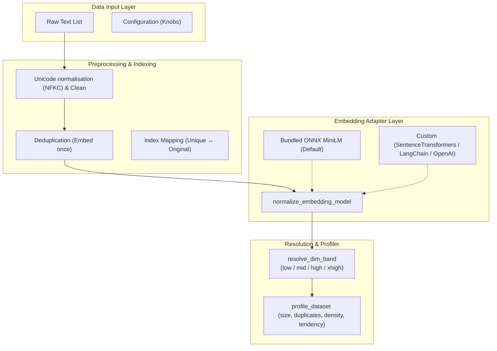
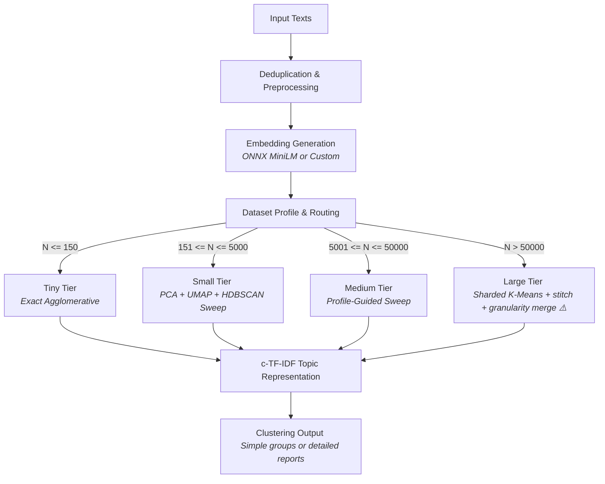
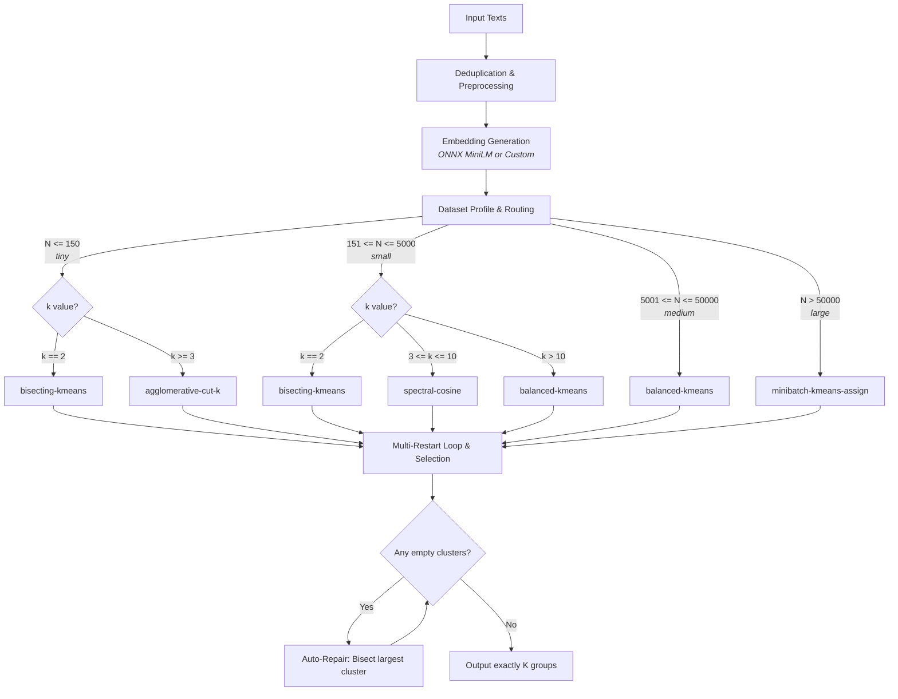
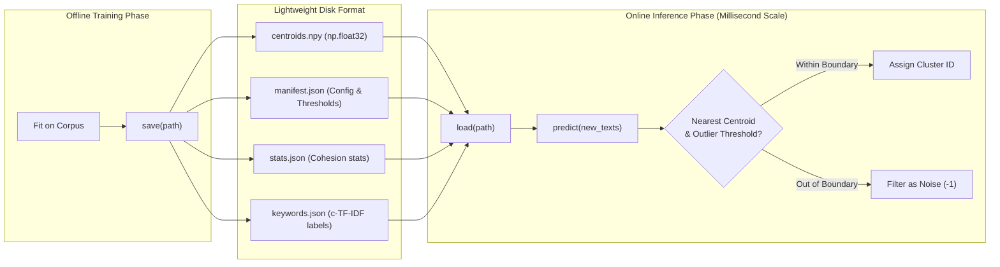

# Semantic Clusterer

**semantic_clusterer** is a premium, zero-configuration Python library for unsupervised semantic text clustering at scale. Designed for machine learning engineers, data scientists, and software architects, it bridges the gap between raw vector embeddings and structured, production-ready topic groups.

---

## 1. The Value Proposition

Traditional text clustering workflows are complex and fragile. They require you to manually guess the number of clusters (K-Means), scale UMAP parameters to avoid high-dimensional distortion, tune HDBSCAN grids to manage noise, and deal with slow prediction-time execution.

**semantic_clusterer** automates this entire lifecycle:
* **Zero Guesswork**: The engine profiles your data size and embedding features to route your corpus through the optimal dimensionality reduction targets and clustering parameter grids.
* **Dual Operation Modes**: Offers variable-K density discovery (`SemanticClusterer`) and fixed-K partitioning (`SemanticKSplit`) under a single unified lifecycle.
* **Production Serialization**: Allows you to fit once offline, save the model as small, inspectable NumPy/JSON arrays, and load it in a separate process for millisecond-scale nearest-centroid inference without loading PyTorch or GPU drivers.

> [!TIP]
> For a fast step-by-step introduction to writing code with the library, see the [User Guide](user_guide.md). For detailed information on the version releases, historical upgrades, and API changes, refer to the [Changelog](changelog.md).

---

## 2. Core Capabilities

* **Dimension Band Autotuning**: Resolves embedding dimensions into four distinct bands (from 256 to 16,384 dimensions) and maps them to custom PCA and UMAP parameter grids (see [How It Works: Dimension bands](working.md#6-dimension-bands)).
* **Scale-Adaptive Multi-Tier Routing**: Automatically selects from four scaling tiers (Tiny, Small, Medium, and Large) to balance memory limits, sweep times, and clustering quality (see [How It Works: Tier routing](working.md#7-tier-routing)).
* **Adaptive Out-of-Distribution Calibration**: Measures cluster cohesion during training to calculate per-cluster outlier boundaries, mapping unaligned incoming queries to noise (`-1`) during inference (see [User Guide: Level 7 - OOD detection](user_guide.md#9-level-7-out-of-distribution-detection) and [How It Works: Out-of-distribution calibration](working.md#15-out-of-distribution-calibration)).
* **Permutation Invariance**: Ensures that identical inputs yield identical cluster assignments regardless of the order in which rows are fed into the library, backed by robust seed propagation (see [User Guide: Determinism parameters](user_guide.md#14-determinism-and-reproducibility) and [How It Works: Permutation invariance](working.md#permutation-invariance)).
* **c-TF-IDF Topic Extraction**: Automatically generates high-fidelity topic labels and key terms for every cluster based on class-based term statistics (see [How It Works: Keyword and topic-label generation](working.md#13-keyword-and-topic-label-generation)).

---

## 3. Real-World Applications

### Support Ticket Routing & Triage
Automatically group thousands of customer tickets into distinct issues. Use `SemanticKSplit` to distribute incoming support queries equally across a fixed set of agents, or use `SemanticClusterer` to discover emerging bugs.

### Semantic Deduplication
Clean raw text datasets before training LLMs by deduplicating semantically identical sentences. The preprocessor identifies and groups duplicate inputs, ensuring that each distinct concept is embedded and processed only once.

### Out-of-Distribution Query Filtering
Determine if a user query belongs to your application's trained domain. The adaptive prediction thresholds filter out unaligned prompts before routing them to expensive generative models.

### Search and Taxonomy Generation
Build dynamic, multi-tier navigation indexes for e-commerce or documentation sites from catalog terms or search queries.

> [!NOTE]
> Every application scenario listed above is backed by a runnable script in the [Examples Gallery](examples.md). You can check out the [01_beginner_zero_config.py](examples.md) and [08_fit_predict_save_load.py](examples.md) scripts to see these use cases implemented.

---

## 4. Architecture Overview

The library separates text cleaning, representation extraction, parameter routing, and post-processing into a clean, modular pipeline.


For a detailed analysis of the adapter structures and normalizations, see [How It Works: Embedding layer](working.md#4-embedding-layer).

---

## 5. Workflow and Routing Engine

The engine routes the dataset through a scaling tier (N-range) to choose the best algorithm and sweep strategy.


For the exact mathematical bounds and parameter ranges for each tier, see [How It Works: Tier routing](working.md#7-tier-routing).

### SemanticKSplit Partitioning Matrix
For fixed-K partitioning, the routing selects a single algorithm from the scaling matrix based on tier and target K, running multi-restart evaluations to avoid local minima:


For detailed partition selection bounds and repair mechanisms, see [How It Works: KSplit internals](working.md#12-semanticksplit-internals).

---

## 6. Production Deployment Lifecycle

Fitting is decoupled from inference. You train your model on offline clusters, serialize it to disk, and deploy a prediction container containing only the raw cluster coordinates.


For detailed manifest schemas, see [How It Works: Fitted state persistence](working.md#14-the-fitted-state-persistence-and-prediction).

---

## 7. Performance & Quality Benchmarks

The library is evaluated against the standard **20 Newsgroups (20NG)** dataset containing 20 highly overlapping classes. The benchmarks compare `SemanticClusterer` (which auto-discovers $K$ unsupervised) and `SemanticKSplit` (which partitions into exactly $K=20$ classes) against published **BERTopic** baselines across multiple embedder models and dataset sizes.

### Unsupervised Routing Accuracy (`SemanticClusterer`)

| Embedder Model | Pipeline Tier (Size) | Discovered K | Adjusted Rand Index (ARI) | Normalized Mutual Info (NMI) | Internal Score | Coverage | Runtime (s) |
|:---|:---:|:---:|:---:|:---:|:---:|:---:|---:|
| **MiniLM** (384-dim) | tiny ($N=116$) | 6 | 0.1432 | 0.4533 | 0.6795 | 100.0% | 53.0s |
| **MiniLM** (384-dim) | small ($N=1,500$) | 24 | 0.3920 | 0.5725 | 0.6662 | 98.4% | 22.1s |
| **MiniLM** (384-dim) | medium ($N=15,000$) | 23 | 0.4089 | 0.5540 | 0.5746 | 98.5% | 3401.4s |
| **MPNet** (768-dim) | tiny ($N=116$) | 6 | 0.1569 | 0.4992 | 0.6976 | 100.0% | 44.5s |
| **MPNet** (768-dim) | small ($N=1,500$) | 22 | 0.4402 | 0.6018 | 0.7135 | 97.9% | 28.2s |
| **MPNet** (768-dim) | medium ($N=15,000$) | 19 | 0.4325 | 0.5870 | 0.6172 | 98.8% | 5496.2s |
| **OpenAI 3-Small** (1536-dim) | tiny ($N=116$) | 6 | 0.2010 | 0.5559 | 0.7114 | 100.0% | 44.4s |
| **OpenAI 3-Small** (1536-dim) | small ($N=1,500$) | 22 | **0.4922** | **0.6516** | 0.7425 | 98.1% | 30.7s |
| **OpenAI 3-Small** (1536-dim) | medium ($N=15,000$) | 22 | **0.4561** | **0.6032** | 0.6013 | 97.9% | 6270.3s |

### Supervised Partition Baselines (`SemanticKSplit`)

| Embedder Model | Pipeline Tier (Size) | Target K | Adjusted Rand Index (ARI) | Normalized Mutual Info (NMI) | Internal Score | Coverage | Runtime (s) |
|:---|:---:|:---:|:---:|:---:|:---:|:---:|---:|
| **MiniLM** (384-dim) | tiny ($N=116$) | 20 | 0.2528 | 0.6448 | 0.5953 | 100.0% | 5.3s |
| **MiniLM** (384-dim) | small ($N=1,500$) | 20 | 0.3808 | 0.5562 | 0.6937 | 99.9% | 1.9s |
| **MiniLM** (384-dim) | medium ($N=15,000$) | 20 | 0.3848 | 0.5303 | 0.6596 | 99.9% | 24.2s |
| **MPNet** (768-dim) | tiny ($N=116$) | 20 | 0.2189 | 0.6288 | 0.5882 | 100.0% | 4.7s |
| **MPNet** (768-dim) | small ($N=1,500$) | 20 | 0.4076 | 0.5938 | 0.6898 | 99.9% | 3.1s |
| **MPNet** (768-dim) | medium ($N=15,000$) | 20 | 0.4322 | 0.5698 | 0.6930 | 99.9% | 29.3s |
| **OpenAI 3-Small** (1536-dim) | tiny ($N=116$) | 20 | 0.2918 | 0.6593 | 0.5734 | 100.0% | 4.8s |
| **OpenAI 3-Small** (1536-dim) | small ($N=1,500$) | 20 | 0.4186 | 0.6000 | 0.6670 | 99.9% | 5.2s |
| **OpenAI 3-Small** (1536-dim) | medium ($N=15,000$) | 20 | **0.4759** | **0.6038** | 0.6693 | 99.9% | 37.8s |

### Head-to-Head vs. BERTopic Baseline

| Evaluation Tier | BERTopic Baseline ARI | `SemanticClusterer` Best ARI | Relative Advantage | Winner |
|:---|:---:|:---:|:---:|:---:|
| **Tiny** ($N=116$) | 0.1671 | **0.2010** *(OpenAI)* | **+20.3%** | 🏆 `SemanticClusterer` |
| **Small** ($N=1,500$) | 0.4435 | **0.4922** *(OpenAI)* | **+11.0%** | 🏆 `SemanticClusterer` |
| **Medium** ($N=15,000$) | 0.4246 | **0.4561** *(OpenAI)* | **+7.4%** | 🏆 `SemanticClusterer` |

### Production API Generalization (Fit $\rightarrow$ Predict)

| Model & Embedder | Tier | Phase | Outlier Threshold | ARI | NMI | Coverage | Noise Ratio |
|:---|:---:|:---|:---:|:---:|:---:|:---:|:---:|
| `SemanticClusterer` (OpenAI) | tiny | Fit (80%) | N/A | 0.1539 | 0.4991 | 100.0% | 0.0% |
| | | Predict (20%) | `auto` | 0.0059 | **0.5988** | **100.0%** | 0.0% |
| `SemanticClusterer` (OpenAI) | small | Fit (80%) | N/A | 0.4553 | 0.6327 | 98.8% | 1.2% |
| | | Predict (20%) | `auto` | **0.4726** | **0.6893** | **98.3%** | 1.7% |
| `SemanticClusterer` (OpenAI) | medium | Fit (80%) | N/A | 0.4447 | 0.6043 | 97.8% | 2.2% |
| | | Predict (20%) | `auto` | **0.4248** | **0.5960** | **99.4%** | 0.6% |
| `SemanticClusterer` (MPNet) | medium | Fit (80%) | N/A | 0.4162 | 0.5669 | 98.3% | 1.7% |
| | | Predict (20%) | `auto` | **0.4132** | **0.5820** | **95.3%** | 4.7% |

For details on the evaluation suite, see [How It Works: Dataset profiling](working.md#5-dataset-profiling).

> [!WARNING]
> **Large pipeline (untested):** All benchmarks above cover the tiny, small, and medium tiers only. The `large` tier (N > 50,000) has been architecturally upgraded with multi-reduction search, granularity-aware HDBSCAN, and the full medium-grade post-processing pipeline, but **has not yet been benchmarked or validated**. Use with caution at this scale.

---

## 8. Ecosystem Compatibility

**semantic_clusterer** adapts to any library or API provider. If your model provides vectors, it integrates seamlessly:
* **HuggingFace & SentenceTransformers**: Works with standard pipeline structures (see [User Guide: Level 4 - Custom embedders](user_guide.md#6-level-4-custom-embedders) and [02_intermediate_custom_embedder.py](examples.md)).
* **Azure OpenAI & OpenAI API**: Integrates with text embeddings endpoints via light call wrappers (see [User Guide: Level 4 - Custom embedders](user_guide.md#6-level-4-custom-embedders) and [07_advanced_azure_openai.py](examples.md)).
* **LangChain Embeddings**: Supports standard document embedding APIs.
* **Local ONNX Execution**: Hardware-accelerated (supporting GPU/NPU acceleration via Execution Providers) or CPU-optimized inference using the built-in ONNX MiniLM model.

For instructions on configuring adapters, see [User Guide: Level 4 - Custom embedders](user_guide.md#6-level-4-custom-embedders).

---

## 9. Installation & Initial Setup

Install the library via PyPI:
```bash
pip install semantic_clusterer
```
Note that `umap-learn` and `hdbscan` will be compiled and installed automatically if not cached. 

> [!NOTE]
> For release dates and version details, consult the [Changelog](changelog.md).

---

## 10. Quick Start Code

### Discovery Workflow
Discovers topic groups from a raw text collection:
```python
from semantic_clusterer import SemanticClusterer

# Default configuration uses local ONNX embedder
clusterer = SemanticClusterer()
groups = clusterer.cluster(texts)
```
For advanced configurations, see [User Guide: Level 9 - Configuration reference](user_guide.md#11-level-9-configuration-reference).

### Partitioning Workflow
Divides inputs into exactly K groups:
```python
from semantic_clusterer import SemanticKSplit

# Partition into exactly 8 non-empty categories
ks = SemanticKSplit(k=8)
groups = ks.split(texts)
```
For execution scripts, navigate to the [Examples Gallery](examples.md).

---

## 11. Documentation Navigation

Use the directory map below to explore specific advanced topics across the guidebooks.

| Topic | User Guide Reference | How It Works Reference |
|:---|:---|:---|
| **Level-by-Level Basics** | [User Guide: Beginner One-Line](user_guide.md#3-level-1-beginner-one-line) | [The end-to-end pipeline](working.md#2-the-end-to-end-pipeline) |
| **Detailed Outputs & keywords** | [User Guide: Detailed reports](user_guide.md#4-level-2-detailed-output-labels-keywords) | [c-TF-IDF Topic labels](working.md#13-keyword-and-topic-label-generation) |
| **Knob Configuration** | [User Guide: Granularity & Quality](user_guide.md#7-level-5-the-two-tuning-knobs) | [Granularity systems](working.md#10-granularity-system) |
| **Out-of-Distribution Calibration** | [User Guide: Adaptive boundaries](user_guide.md#9-level-7-out-of-distribution-detection) | [OOD boundary math](working.md#15-out-of-distribution-calibration) |
| **Model Persistence** | [User Guide: fit / predict / save / load](user_guide.md#8-level-6-production-lifecycle-fit-predict-save-load) | [Manifest schemas](working.md#14-the-fitted-state-persistence-and-prediction) |
| **Scale and Sharding Limits** | [Level 10 - Subsampling & capping overrides](user_guide.md#12-level-10-power-user-controls) | [Large Tier Sharding](working.md#large-pipelinelargepy-shard-cluster-stitch) |
| **Reproducibility** | [User Guide: Determinism parameters](user_guide.md#14-determinism-and-reproducibility) | [Determinism design](working.md#16-determinism-model) |

---

## 12. Community & Feedback

We'd love to hear how you are using `semantic_clusterer` and what features you'd like in v0.2.0!
- 💬 **Feedback Form**: [Share your feedback & vote on upcoming features](https://forms.gle/u1djkvY9HYqua1CdA)
- 🐛 **GitHub Issues**: [Report an issue or suggest an improvement](https://github.com/Baishnab1708/semantic_clusterer/issues)
- ⭐ **GitHub Repository**: [Star us on GitHub](https://github.com/Baishnab1708/semantic_clusterer)

---

## License

This library is licensed under the [MIT License](https://github.com/Baishnab1708/semantic_clusterer/blob/main/LICENSE).
