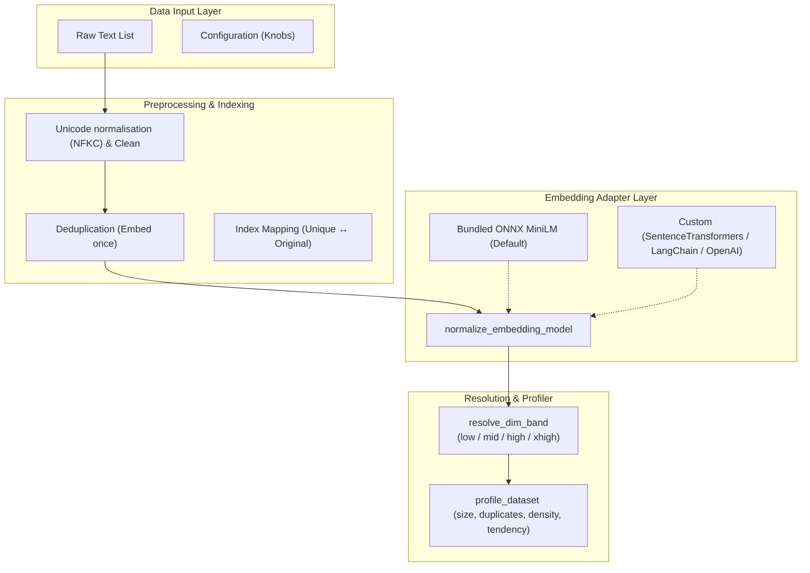
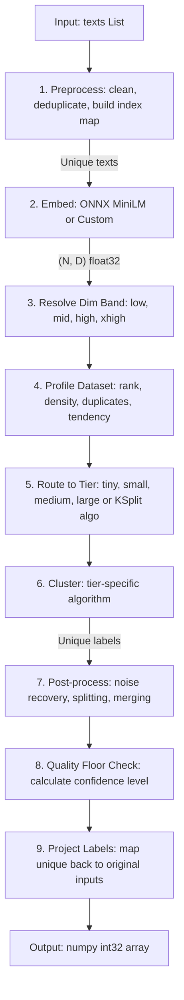
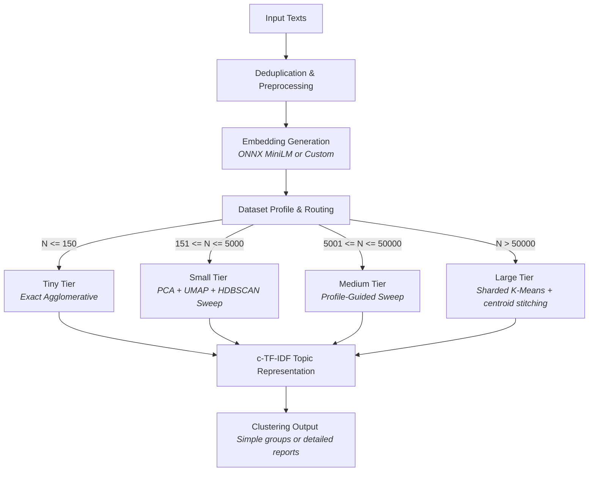
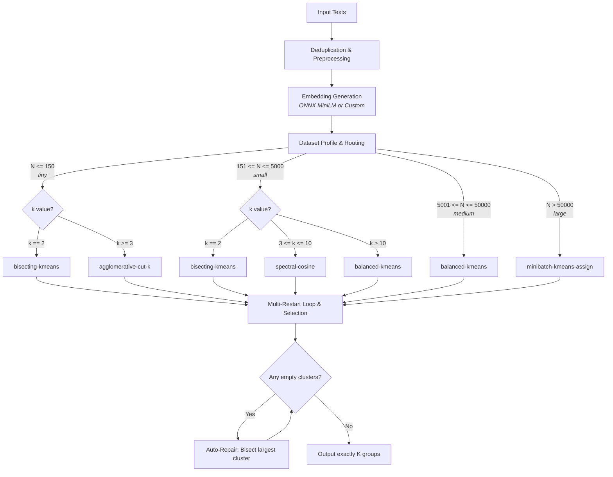
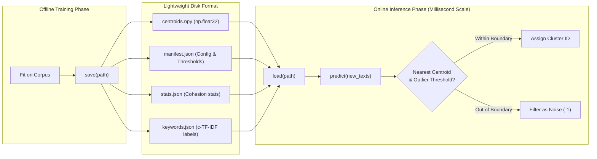

# **How semantic_clusterer Works**

This document explains the **internals** of `semantic_clusterer`: the
architecture, the per-tier algorithms, the scoring objective, the adaptive
parameter system, and the determinism model. It is written for contributors and
for advanced users who want to understand *why* the library produces the
results it does.

If you just want to use the library, start with [`index.md`](index.md) and
[`user_guide.md`](user_guide.md). This document assumes you've read those.

---


## 1. Design philosophy

The library is built around four principles:

1. **Zero required configuration.** The default path - `SemanticClusterer()` -
   must produce good clusters with no parameters. Every internal decision
   (tier, reduction dimension, parameter grid) is derived from the data.

2. **Two knobs, not twenty.** Users get exactly one primary knob per class
   (`cluster_granularity` / `quality`). Everything else that *could* be a knob
   (tier, reduction method, UMAP/HDBSCAN parameters) is chosen automatically.
   This is a deliberate constraint: fewer knobs means fewer ways to get it
   wrong, and consistent results across users. Pipeline tier and dimensionality
   reduction were once exposed as `strategy` / `reduction` config fields; they
   were deliberately made internal so the public surface stays minimal and the
   routing stays a pure function of the data (see [section 7](#7-tier-routing)).

3. **Adapt to the embedding, not the other way around.** The library detects
   the embedding dimension and selects a matching parameter grid (the
   "dimension band" system). Swapping a 384-dim model for a 3072-dim one
   requires zero retuning.

4. **Determinism within a fixed environment.** Given the same seed and the same
   dependency versions, runs are reproducible. The single place where a
   third-party library touches numpy's global RNG (HDBSCAN) is wrapped in a
   save/restore context manager.

A useful consequence: **the only hardcoded "magic numbers" in the library live
in two small tables** - the dimension-band grids (`pipeline/tuning.py`) and the
granularity profiles (`pipeline/granularity.py`). Everything else is computed
from the data profile.

---

## 2. The end-to-end pipeline

Both public classes follow the same high-level flow. For `SemanticClusterer`
the orchestrator is `SemanticClusterer._run_clustering` (in `core.py`); for
`SemanticKSplit` it is `SemanticKSplit._run_split` (in `k_split.py`).



### End-to-end sequence



Progress through these phases is reported through `PipelineProgress`
(`utils/progress.py`) and timed into `report.phase_timings`.

---

## 3. Preprocessing and deduplication

`TextPreprocessor` (`preprocessing/clean.py`) runs before embedding:

1. **Missing-value handling** - `None`, float `NaN`, numpy `NaN`, and pandas
   `NA`/`NaT` are detected and mapped to the filtered label `-1`. Non-string,
   non-missing objects (dicts, lists) raise `TypeError`.
2. **Unicode normalisation** - NFKC.
3. **Lowercasing** (default on).
4. **Punctuation removal** (default on) - replaced with spaces.
5. **Whitespace normalisation** - runs collapsed to single spaces, trimmed.
6. **Deduplication** - identical cleaned strings are embedded once.

The key output is the **index map**: `original_to_processed` maps every input
row to either a processed-row index or `-1` (filtered). This is what lets the
library return a label array aligned with the *original* input order, with
duplicates sharing a label and missing rows getting `-1`.

Deduplication matters for cost: a corpus with many repeated strings only pays
to embed and cluster the unique set.

---

## 4. Embedding layer

### Adapters

`normalize_embedding_model` (`embedding/adapters.py`) wraps whatever you pass
into a uniform `.embed(texts, batch_size)` interface by sniffing the object:

| Detected interface | Adapter | Notes |
|--------------------|---------|-------|
| `.embed(...)` | `NativeEmbedAdapter` | Auto-detects whether `batch_size` is accepted |
| `.encode(...)` | `EncodeAdapter` | SentenceTransformers/HF - passes `batch_size` natively |
| `.embed_documents(...)` | `LangchainAdapter` | LangChain - ignores `batch_size` (it batches internally) |
| callable | `CallableAdapter` | Manually chunks into `batch_size` blocks to protect remote APIs |

Basic Python types (`str`, `dict`, etc.) are rejected even though some have an
`.encode` method, to avoid accidentally treating a string as a model.

### Validation

`validate_embeddings` enforces the contract: 2D shape `(n_texts, dim)`, row
count matches text count, numeric dtype, no `NaN`/`Inf`, cast to `float32`. A
1D array is accepted only for a single text and reshaped to `(1, dim)`.

### Built-in ONNX embedder

`OnnxEmbedder` (`embedding/onnx_model.py`) is the default when no model is
supplied:

- **all-MiniLM-L6-v2**, 384-dim, max sequence length 256.
- Downloaded on first use from a pinned HuggingFace commit, **checksum-verified**
  (SHA256) and cached to `~/.cache/semantic_clusterer/`. A corrupt cache file is
  deleted and re-downloaded once.
- Hardware-accelerated inference via `onnxruntime` using dynamic execution providers (prioritizing GPU/NPU EPs, falling back to CPU). CPU threads set to `os.cpu_count()`.
- Mean-pooling over token embeddings with the attention mask, then L2
  normalisation.
- A `tqdm` progress bar appears for multi-batch runs.

Because it already L2-normalises, the pipeline skips re-normalising its output;
custom models are normalised by the pipeline when `normalize_embeddings=True`.

---

## 5. Dataset profiling

`compute_dataset_profile` (`pipeline/profile.py`) builds a bounded statistical
summary used to tune the medium and large pipelines. It is deliberately
**sub-linear**: it samples rows (`min(N, max(1024, min(4096, 16·√N)))`) and
never materialises an `N×N` matrix.

The `DatasetProfile` fields:

| Field | What it estimates | How |
|-------|-------------------|-----|
| `effective_rank` | Intrinsic dimensionality | Randomised TruncatedSVD; rank capturing 90% variance |
| `variance_decay_ratio` | Variance captured at effective rank | SVD explained-variance sum |
| `local_density_mean` / `_cv` | Neighbourhood tightness + its variation | k-NN (cosine) distances |
| `distance_concentration` | How "samey" pairwise distances are | sampled pair cosine distances |
| `duplicate_ratio` / `near_duplicate_ratio` | Fraction of (near-)duplicates | nearest-neighbour distance thresholds |
| `cluster_tendency` | Clusterability | Hopkins-style real-vs-random density ratio |
| `imbalance_tendency` | Likely cluster size skew | KMeans probe + size entropy |
| `memory_pressure` | Expected working-set vs a budget | `N·D` byte estimate vs ~6 GB |

These values drive: the target reduction dimension, the UMAP neighbour/component
candidates, the HDBSCAN `min_cluster_size`/`min_samples` grids, refinement
trigger thresholds, and (for the large tier) the shard size and coarse partition
count. The profile is also recorded in `report.dataset_profile`.

---

## 6. Dimension bands

Defined in `dim_bands.py`. Embedding dimension `D` is resolved into one of four
**bands**, each with its own parameter grid:

| Band | Inclusive range | Example model |
|------|-----------------|---------------|
| `low` | 256 – 511 | MiniLM-L6-v2 (384) |
| `mid` | 512 – 1023 | MPNet-base-v2 (768) |
| `high` | 1024 – 2047 | BGE-large (1024), text-embedding-3-small (1536) |
| `xhigh` | 2048 – 16384 | text-embedding-3-large (3072) |

`resolve_dim_band(D)`:

- `D < 1` → `ValueError`.
- `1 <= D < 256` → falls back to `low` with a `UserWarning`.
- `D > 16384` → falls back to `xhigh` with a `UserWarning`.

`SUPPORTED_DIM_BANDS` is the public, read-only mapping. The whole point of bands
is that **parameter grids scale with embedding geometry** - higher-dimensional
spaces concentrate cosine similarities, so merge thresholds, PCA targets, and
UMAP settings differ per band. This is why changing embedder requires no
retuning.

The grids live in `pipeline/tuning.py` as `get_band_grid(band, tier)`, the
single source of truth for `(band, tier)` parameter sets. A `BandGrid`
(`dim_bands.py`) holds PCA targets, UMAP neighbour/component candidates, HDBSCAN
ratios/min_samples/methods, and the tiny-tier K grid.

---

## 7. Tier routing

`_BaseConfig.get_strategy_for_size(N)` (in `config.py`) maps the number of
**unique** texts to a tier using fixed thresholds:

| Tier | Unique N |
|------|----------|
| `tiny` | `N <= 150` |
| `small` | `151 <= N <= 5000` |
| `medium` | `5001 <= N <= 50000` |
| `large` | `50001 <= N <= 200000` |

This routing is **purely a function of N** - there is no user override (the
former `strategy` config field was removed). Reduction is likewise automatic:
`get_reduction_for_strategy(tier)` returns `None` for tiny/small (cluster in the
embedding/UMAP space directly) and `"pca"` for medium/large.

`SemanticClusterer._cluster_embeddings` also short-circuits the trivial cases:
`N == 1` → `[0]`, `N == 2` → `[0, 1]`.

---

## 8. SemanticClusterer tiers



Each tier is a self-contained module under `pipeline/`. All return an `int32`
label array over the unique rows, with `-1` for noise.

### Tiny (`pipeline/tiny.py`) - exact hierarchical search

For `N <= 150`, an exhaustive, deterministic approach is affordable:

1. **Degenerate cases** - `N=0/1`, all-identical embeddings (one cluster),
   `N=2` (split unless cosine $\ge 0.95$).
2. **Dual linkage matrices** - Ward linkage on normalized vectors, and average linkage on cosine distance. Both are always constructed and evaluated.
3. **Five candidate sources for K**:
   - *Multi-scale dendrogram-jump* - extracts all merge heights with z-score gap significance $>1.0$ (up to 5 candidates).
   - *Adaptive K-grid* - dynamically generated list of K values based on $N$ (linear steps for $N \le 30$; logarithmic scaling up to $N//2$ for larger $N$).
   - *Silhouette-optimal* - best silhouette score over the grid for both linkages.
   - *Miniature UMAP+HDBSCAN* - density-based clustering for $N \ge 15$, with scale-adaptive neighbors, components, and min cluster size.
   - *Spectral clustering* - affinity-based clustering for $N \ge 8$ on a precomputed cosine-similarity matrix.
4. **Label-aware deduplication** - candidates are deduplicated by `(K, partition_hash)`, preserving distinct cluster assignments at the same $K$.
5. **Score every candidate** with the shared scoring objective (section 9) and
   pick the best, tie-broken by: maximum score $\rightarrow$ smaller $K$ $\rightarrow$ density-based/spectral priority order.
6. **Post-processing** - granularity-controlled centroid merge pass.

### Small (`pipeline/small.py`) - UMAP + HDBSCAN sweep

For `151 <= N <= 5000`:

1. **Optional PCA pre-reduction** - for non-low bands, reduce toward a
   band-appropriate target before the UMAP sweep. (Low band is already compact.)
2. **Adaptive anchors** - UMAP `n_neighbors` and `n_components` from
   `reduction/umap_utils.py` (log-scaled in N and dim).
3. **Primary sweep** - a grid over UMAP `(n_neighbors, n_components, min_dist)` ×
   HDBSCAN `(min_cluster_size, min_samples, method)`, with UMAP embeddings
   cached per `(nn, nc, min_dist)` so each reduction is computed once.
4. **Refinement** - only when the best solution looks weak or blob-like (low
   score, high noise, or a dominant cluster); re-sweeps a couple of neighbour
   multipliers.
5. **Winner refit** - recompute true DBCV on the winning UMAP embedding.
6. **Post-processing** - confident noise recovery, oversized-cluster splitting,
   near-duplicate merge, then a second noise recovery, then the granularity
   merge pass.

If `umap-learn` is unavailable, the sweep degrades to PCA-only HDBSCAN and emits
a one-time `UserWarning`.

### Medium (`pipeline/medium.py`) - profiled sweep

For `5001 <= N <= 50000`, similar to small but profile-driven:

1. **xhigh PCA pre-reduction** (when band is xhigh) to the first PCA target.
2. **Profile** the dataset.
3. **Reduction candidates** - a small set of PCA target dimensions around a
   profile-derived center (`compute_medium_reduction_dimension` +
   `compute_reduction_candidates`). Each representation is built once and cached.
4. **HDBSCAN candidate generation** from band ratios scaled by N, with
   profile-aware `min_samples` and method selection.
5. **Two evaluation paths per representation** - direct HDBSCAN on the
   PCA-reduced space, and HDBSCAN on a further UMAP embedding (when UMAP is
   available and the representation is informative).
6. **Refinement** when triggered by `should_trigger_refinement` against
   profile-derived thresholds.
7. **Post-processing** identical in spirit to small (recover/split/merge) plus
   the granularity merge pass.

### Large (`pipeline/large.py`) - shard, cluster, stitch

For `50001 <= N <= 200000`, a divide-and-conquer strategy keeps memory bounded:

1. **Multi-reduction PCA search** - generates 2 candidates around a profile-derived target dimension and fits PCA representations.
2. **Coarse partition** - `MiniBatchKMeans` into `n_coarse` partitions, sized so each shard targets `compute_large_target_shard_size` rows.
3. **Shard balancing** - recursively split oversized shards (`_balance_shards`).
4. **Per-shard HDBSCAN with granularity-aware spread** - runs multi-reduction and `mcs_candidate_spread(gran_profile, shard_size)` across both `eom` and `leaf` methods, with a conservative centroid fallback when a shard fails to cluster.
5. **Per-shard quality tracking** - scores recorded; if >30% of shards are weak, confidence is lowered.
6. **Global stitching** (`_global_stitch_clusters`) - merges clusters that are near-duplicates **across** shard boundaries using a union-find over mutual nearest centroids with radius checks (similarity threshold 0.93–0.96). Intra-shard pairs are never stitched.
7. **Full post-processing pipeline** - noise recovery with confidence, weak oversized cluster splitting (`split_oversized_clusters`), near-duplicate merging, granularity-driven centroid merge (`merge_clusters_by_centroid_similarity`), and a `CentroidFallback` pass if residual noise exceeds 30%.

> [!WARNING]
> **Large pipeline validation status:** The `large` tier has been upgraded to match the multi-reduction and granularity post-processing architecture of the medium tier, but **has not yet been benchmarked or tested** in v0.1.0 releases. Tiny, small, and medium tiers are fully benchmarked and verified.

---

## 9. The scoring objective

`score_clustering` (`pipeline/quality.py`) is the shared, label-free objective
that every tier uses to choose between candidate clusterings. It returns a
composite `score` in `[0, 1]` and the component metrics.

The composite is a weighted sum of positive terms minus penalties:

| Term | Default weight | Direction |
|------|----------------|-----------|
| `density` (HDBSCAN DBCV, when available) | 0.15 | reward |
| `coverage` (`1 − noise_ratio`) | 0.15 | reward |
| `cohesion` (size-weighted mean within-cluster similarity) | 0.20 | reward |
| `separation` (mean centroid-to-centroid distance) | 0.22 | reward |
| `stability` (cluster size balance) | 0.10 | reward |
| `fragmentation_penalty` (size-relative + count-relative micro-clusters) | 0.10 | penalty |
| `largest_cluster_penalty` (giant-cluster excess over a 0.10 baseline) | 0.10 | penalty |

Notable details:

- **Density weight redistribution.** When HDBSCAN DBCV is unavailable (e.g.
  PCA-only fallback), the density weight is redistributed proportionally across
  the other positive terms, so scores remain comparable.
- **High-dimensional separation scaling.** High-dimensional embeddings ($D \ge 512, 1024$) naturally compress cosine separation into a narrow low range. Separation is scaled up dynamically to give high-dimensional embeddings a fair comparison.
- **Low-K separation zeroing.** For $K \le 3$ on datasets with $N > 150$, separation is zeroed out to prevent trivial under-clustering on larger corpora.
- **Symmetric under-fragmentation dampening.** On larger corpora ($N > 500$), if $K < \max(4, \text{count\_baseline} // 2)$ where $\text{count\_baseline} = \min(22, \lfloor\sqrt{N/3}\rfloor)$, separation is scaled by $\frac{K}{K_{\text{threshold}}}$. This prevents trivial over-merging (e.g. $K=4$ on 12K texts) from dominating the scoring objective.
- **Fragmentation is size-aware and count-aware.** Combines micro-cluster size thresholds ($<25\%$ of expected cluster size) and count-relative penalties for $K > \text{count\_baseline}$.
- **Blob penalty.** Penalises solutions containing clusters with very low internal cohesion ($\text{mean similarity} < 0.15$).
- **Empty/degenerate partitions** score 0 with `largest_ratio = 1` and `noise_ratio = 1`.

`should_trigger_refinement` compares the component metrics against
profile-derived thresholds (coverage, noise, giant-cluster ratio, stability) to
decide whether a tier should run a second, narrower search.

---

## 10. Granularity system

`cluster_granularity` is realised by `pipeline/granularity.py`, which holds a
`(preset, band)` table of `GranularityProfile` values. This is one of only two
tables of hardcoded constants in the library, and they follow a single
principle: **cosine similarity concentrates as dimension rises, so merge
thresholds decrease as the band rises.**

A `GranularityProfile` carries:

- `mcs_sqrt_coef` - the primary driver for the `min_cluster_size` floor, scaling as `coef * sqrt(N)`.
- `mcs_sub_floor_ratio` - controls how aggressively to explore candidates below the floor.
- `mcs_ratio_floor` and `mcs_absolute_floor` - upper and lower clamps on the floor.
- `merge_centroid_threshold` - cosine similarity above which two clusters are merged.
- `fragmentation_penalty_weight` - extra weight on fragmentation in scoring.

| Preset | Floor Coef | Sub-floor ratio | Effect |
|--------|------------|-----------------|--------|
| `fine` | 0.5 (~60 at 15k) | 0.4 (aggressive) | Most clusters. Near-duplicate merge only. |
| `balanced` | 0.7 (~85 at 15k) | 0.6 (moderate) | Clean default. Meaningful merge pass. |
| `coarse` | 1.2 (~147 at 15k) | 0.0 (none) | Fewest, broadest clusters. Strong frag penalty. |

`apply_mcs_floor` computes the floor. The sub-linear `sqrt(N)` scaling ensures the floor grows slowly with the corpus size, allowing the cluster count to grow naturally without collapsing into giant blobs. `mcs_candidate_spread` generates a 3-to-5 value search grid anchored around this floor, and the scoring objective picks the best K.

If the user sets an explicit `min_cluster_size`, that value always wins and the granularity floor is ignored. The merge pass is `merge_clusters_by_centroid_similarity` (union-find, iterated to convergence).
`merge_clusters_by_centroid_similarity` (union-find, iterated to convergence).

---

## 11. Post-processing

Shared post-processing lives in `pipeline/postprocess.py` and runs after the
core clustering in small/medium/large:

- **`recover_noise_with_confidence`** - reassigns noise points to the nearest
  cluster *only* when they're within an adaptive distance threshold and clearly
  closer to one cluster than the runner-up. Cautious by design: ambiguous points
  stay noise.
- **`split_oversized_clusters`** - bisects weak, oversized clusters via a
  sub-UMAP + sub-HDBSCAN pass, but **only commits the split if the global score
  improves**. Cohesive or small clusters are left alone.
- **`merge_near_duplicate_clusters`** - union-find merge of clusters whose
  centroids exceed a high similarity threshold.
- **`merge_clusters_by_centroid_similarity`** - the granularity-driven merge
  (lower threshold, iterated to convergence).
- **`compact_labels`** - remaps surviving labels to a contiguous `0..K-1` range,
  preserving `-1`.

`CentroidFallback` (`clustering/centroid_fallback.py`) is the large-tier safety
net: when residual noise is high, it assigns remaining noise points to the
nearest valid centroid so the result isn't mostly `-1`.

---

## 12. SemanticKSplit internals


`SemanticKSplit` (`k_split.py`) guarantees exactly `k` non-empty clusters. It
shares preprocessing, embedding, band resolution, and tier routing with
`SemanticClusterer`, but the clustering step is different: it selects a single
partition algorithm from a `(tier, k)` matrix rather than running a
density-based sweep. It does **not** import `hdbscan`.



### Algorithm selection matrix

`_select_k_algorithm` (`k_algorithms/selection.py`):

| Tier | k | Algorithm |
|------|---|-----------|
| tiny | `k == 2` | `bisecting-kmeans` |
| tiny | `k >= 3` | `agglomerative-cut-k` |
| small | `k == 2` | `bisecting-kmeans` |
| small | `3 <= k <= 10` | `spectral-cosine` |
| small | `k > 10` | `balanced-kmeans` |
| medium | any | `balanced-kmeans` |
| large | any | `minibatch-kmeans-assign` |

Two more algorithm names appear at runtime: `constrained-kmeans` (spectral's
fallback when the eigensolver fails) and `identical-embeddings-tiebreak` (all
embeddings identical → deterministic round-robin).

### The algorithms (`k_algorithms/`)

- **`agglomerative.py`** - `AgglomerativeClustering` with average linkage on
  cosine distance, cut at `k`. Deterministic; no restarts.
- **`bisecting.py`** - `BisectingKMeans` (largest-cluster strategy) wrapped in
  multi-restart (5 restarts when `k==2`, else 3).
- **`balanced.py`** - Lloyd KMeans wrapped in multi-restart (default 3).
- **`spectral.py`** - `SpectralClustering` on a precomputed cosine-affinity
  matrix (`(cos+1)/2`, clipped). Falls back to `constrained-kmeans` on
  eigensolver failure and records the substitution in the trace.
- **`minibatch_assign.py`** - single `MiniBatchKMeans` fit, then a final hard
  cosine assignment of every row to its nearest centroid. Also exposes
  `_assign_to_nearest_centroid` used by the oversized path.
- **`degenerate.py`** - `_all_identical` detection and `_round_robin_labels`.

### Multi-restart and selection

`k_algorithms/restart.py` runs `n_restarts` seeded trials and keeps the best
by a sortable key: **cosine silhouette (higher better) → Davies–Bouldin (lower
better) → restart index (earlier wins ties)**. The i-th restart uses
`seed_i = (seed + i) mod 2³²`. `quality_profile.py` maps the `quality` preset and
tier to the restart count (e.g. `balanced`+`small` → 5, `best`+`tiny` → 12).

### Empty-cluster repair

`k_algorithms/repair.py` guarantees all `k` labels are populated. While any
label in `[0, k-1]` is missing, it bisects the largest cluster and moves the
smaller half into the missing label. It records `"empty-cluster-repaired"` once.

### Permutation invariance

Before dispatching, `_run_split` sorts rows by a lexicographic key
(`np.lexsort`) and unsorts the labels afterward, so the output is invariant to
input row order for a fixed seed.

---

## 13. Keyword and topic-label generation

`representation/keywords.py` is a **pure post-processing layer** - it never
affects cluster assignments, parameters, or routing.

### c-TF-IDF keywords

`extract_cluster_keywords` concatenates each cluster's texts into one
"document", builds a count matrix with `CountVectorizer` (unigrams + bigrams,
English stop words), and computes an enhanced class-based TF-IDF:

1. **L1 Normalisation**: Normalises Count-TF counts per class to make keyword representation document-length invariant.
2. **BM25 Saturation**: Applies a sublinear frequency scaling (BM25 term saturation with $k1=1.5$) to prevent highly frequent terms in a single cluster from dominating the scores.
3. **Corpus-Aware Stop Word Demotion**: Identifies terms appearing uniformly across $>80\%$ of clusters with low score variance (CV $<0.5$) and demotes their scores by $0.1\times$ to filter domain-specific noise (e.g. the word "ticket" in a customer support dataset).

The formula:

$$score(word, cluster) = \frac{tf_{norm} \cdot (k1 + 1)}{tf_{norm} + k1} \cdot \log\left(1 + \frac{A}{tf_{global}}\right)$$

where $A$ is the mean words-per-cluster and $tf_{global}$ is the word's total count across the entire corpus. The top-N words per cluster are returned with their scores.

### Topic labels

`generate_topic_label` re-scores the top keywords for *label suitability* (a
different goal than keyword ranking):

- Bigrams are preferred (usually clean noun phrases).
- Noun-suffix words (`-tion`, `-ity`, `-ware`, …) are boosted.
- Generic predicate verbs (`provides`, `ensures`, …) are rejected.
- Standalone adjectives are demoted.

It then selects the top-2 non-overlapping candidates using an **MMR-style Jaccard similarity check on character trigrams** (demoting candidates with trigram Jaccard $>0.5$ overlap to prevent near-synonym combinations like "security" and "secure"), and joins them, e.g. `"Cybersecurity & Encryption"`. Everything is wrapped in `try/except` so a labelling failure never breaks clustering output.

---

## 14. The fitted state, persistence, and prediction



### FittedState

`persistence.py` defines `FittedState`, the compact snapshot built by
`_build_fitted_state` at the end of `fit()`/`fit_predict()`:

- L2-normalised `centroids` and their `cluster_ids`.
- `train_labels` aligned with the original input.
- `embedding_dim`, `dim_band`, `mode` (`"density"` or `"fixed_k"`), `n_clusters`.
- **Calibration (Schema v3)**: 
  - `auto_outlier_threshold` (fallback global scalar)
  - `cluster_cohesion` (rich `ClusterStats` per cluster: `min_sim`, `mean_sim`, `median_sim`, `std_sim`, `p10_sim`, `p25_sim`, `radius_95`)
  - `max_inter_centroid_sim`
  - `inter_centroid_sims` (full $K \times K$ inter-centroid similarity matrix).
- `keywords` and `topic_labels`.
- `config_snapshot` (public fields only) and `library_version`.
- Optional `reducer` (a fitted PCA) - only when reduction was used.

### Save format (manifest schema v3)

`save_state` writes a directory: `manifest.json` (written last, signalling
consistency), `centroids.npy`, `inter_centroid_sims.npy`, `labels.npy`, `keywords.json`, `stats.json`, and
optionally `reducer.pkl`. The manifest embeds the `class_name` to prevent
loading a `SemanticKSplit` model into `SemanticClusterer` by mistake.

`load_state` reads schemas v1, v2, and v3. Legacy models load cleanly, filling missing schema v3 calibration fields with safe defaults.

The embedding model is **never** serialised - by design.

### Prediction

`predict()` embeds new texts, applies the saved reducer if present, normalises,
and calls `assign_to_centroids` to compute a cosine dot product against the stored centroids. 
- **Vectorized OOD Assignment**: Replaces Python loops with fully vectorized numpy operations, checking cosine similarities against per-cluster adaptive thresholds in $O(N)$ time.
- **Margin-Based Disambiguation**: When the top-2 cluster similarities are within a margin of $0.03$, the classifier resolves the tiebreaker by prioritizing the cluster with higher density or semantic keyword overlap.

---

## 15. Out-of-distribution calibration

Calibration computes two levels of OOD safety nets during training:

### A. Global Outlier Threshold
1. Pool all member-to-centroid similarities.
2. Take the **5th percentile** (`global_p5`) - 95% of genuine training members clear it.
3. Compute `max_inter` = the highest pairwise centroid similarity (overlap).
4. Combine:
   ```
   auto_threshold = max(0.05, global_p5 · 0.90 − 0.05 · max(0, max_inter))
   ```

### B. Per-Cluster Adaptive Thresholds (Default `"auto"` Mode)
A custom boundary is calculated for each cluster $c$:
1. **Size-Aware Percentile Floor**:
   - Clusters with size $\ge 50$ use the cluster's `p10_sim`.
   - Clusters with size $\le 10$ use `p25_sim` (strict, conservative boundary).
   - In between, the percentile floor is linearly blended between `p25` and `p10`.
2. **Tightness Bonus**: If a cluster is highly cohesive, its threshold is tightened:
   $$bonus = \max(0, (mean\_sim_c - 0.5)) \cdot 0.1$$
3. **Neighbor Confusion Relaxation**: If a cluster centroid has neighbors with similarity $>0.7$, the boundary is relaxed slightly:
   $$relaxation = 0.03 \cdot n\_confused\_neighbors$$
4. **Dynamic Pullback Factor & Small-Data Safety Valve**:
   - On standard corpora: $\text{pullback} = 0.70 + 0.15 \cdot \min(1.0, \frac{\text{size}_c}{50})$
   - **Small-Data Regime ($N_{\text{train}} < 200$ or $\max(\text{size}) < 30$):** Centroids from sparse training points overfit and create artificially tight similarity distributions. To avoid over-rejecting valid test data, pullback reduces to $0.45 + 0.10 \cdot \min(1.0, \frac{\text{size}_c}{50})$, the tightness bonus is capped at $0.02$, and $\text{threshold}_c$ is bounded above by the global `auto_outlier_threshold`.
5. Combined:
   $$threshold_c = \max(0.05, base\_floor \cdot pullback - relaxation + bonus - 0.02 \cdot max\_inter)$$

This prevents tight, high-density clusters from incorrectly absorbing loose queries, stops loose clusters from dropping valid queries, and ensures robust generalization even on small training datasets.

---

## 16. Determinism model

The library targets reproducibility within a fixed environment ("Determinism
Scope"): same library version, Python minor, OS family, and major.minor of
`numpy`/`scikit-learn`/`hdbscan`/`umap-learn`, plus the same `random_state`.

Mechanisms:

- **Seed validation** - `random_state` must be an int in `[0, 2³²−1]`; booleans
  rejected. The constructor kwarg wins over a config value on conflict.
- **Seeded RNGs** - profiling, subsampling, and KMeans-family algorithms take
  explicit seeds. Multi-restart uses `(seed + i) mod 2³²`.
- **The HDBSCAN global-RNG guard** - HDBSCAN reads numpy's *global* RNG.
  `_seeded_global_numpy(seed)` (`optional_deps.py`) saves the global state, seeds
  it, runs HDBSCAN, and restores the prior state in a `finally` block. Only
  HDBSCAN is permitted inside that context; anything else touching the global
  RNG would break the guarantee.
- **Permutation invariance** - `SemanticKSplit` sorts rows before clustering and
  unsorts after.

"Permutation-equivalent" output means the *grouping* is stable; integer cluster
ids may be relabelled between runs. For stable ids, `fit` + `save`/`load` rather
than re-clustering.

---

## 17. Quality floors and confidence

`_quality_floor.py` enforces soft quality gates after clustering. Per-tier floors
load from `tests/fixtures/release_ready/baseline_scores.json` at import (falling
back to 0.30 with a warning if absent).

`_enforce_quality_floor` raises a `UserWarning` and lowers
`report.confidence_level` to `"low"` (tagging `report.warnings`) when either:

1. The noise ratio exceeds 0.85 (`"high-noise-ratio"`), or
2. The dataset is clusterable (`cluster_tendency >= 0.40`) yet the score is below
   the tier floor (`"no-cluster-met-quality-floor"`).

These never fail the run - they annotate it so callers can react. The large tier
adds `"large-low-shard-quality"` when more than 30% of shards score poorly.

---

## 18. Oversized datasets

When unique `N` exceeds `max_samples` (default 200,000):

- With the **default cap**, `SemanticClusterer` raises `ValueError`. (The
  deprecated `allow_oversized_datasets=True` rewrites the cap to `None`.)
- With **`max_samples=None`** (or a custom cap), the library takes the
  **subsample-then-assign** path: deterministically subsample to the limit,
  cluster the subsample with the large pipeline, build per-cluster centroids,
  then assign out-of-sample rows in chunks by nearest centroid. A
  `"oversized-subsampled"` warning is recorded.

`SemanticKSplit` has the parallel `_oversized_subsample_and_assign_k`
(`k_algorithms/oversized.py`): subsample → `minibatch-kmeans-assign` → repair
empty clusters → centroid build → nearest-centroid assignment for the rest. The
gating error/warning strings are shared module-level constants so wording is
byte-identical between the two classes.

---

## 19. Module map

```
semantic_clusterer/
├── __init__.py            Lazy public exports (PEP 562 __getattr__)
├── config.py              _BaseConfig, SemanticClustererConfig,
│                          SemanticKSplitConfig, ClustererConfig (alias);
│                          tier routing + reduction policy live here
├── core.py                SemanticClusterer: orchestration, fit/predict/
│                          save/load, oversized handling, fitted-state build
├── k_split.py             SemanticKSplit: fixed-k orchestration + lifecycle
├── dim_bands.py           Band ranges, resolve_dim_band, BandGrid
├── report.py              ClusteringReport, _PipelineTrace, JSON coercion
├── persistence.py         FittedState, ClusterStats, save/load,
│                          assign_to_centroids
├── _quality_floor.py      Soft quality gates + confidence downgrade
├── optional_deps.py       try_import_umap, _seeded_global_numpy (RNG guard)
│
├── embedding/
│   ├── adapters.py        normalize_embedding_model, validate_embeddings
│   ├── base.py            BaseEmbedder protocol
│   └── onnx_model.py      Built-in MiniLM-L6-v2 ONNX embedder
│
├── preprocessing/
│   └── clean.py           TextPreprocessor (clean + dedupe + index map)
│
├── profile via pipeline/profile.py
├── pipeline/
│   ├── profile.py         compute_dataset_profile + DatasetProfile
│   ├── tiny.py            Tiny tier (agglomerative + candidate scoring)
│   ├── small.py           Small tier (UMAP + HDBSCAN sweep)
│   ├── medium.py          Medium tier (profiled sweep)
│   ├── large.py           Large tier (shard → cluster → stitch)
│   ├── quality.py         score_clustering, compute_cluster_stats,
│   │                      should_trigger_refinement
│   ├── tuning.py          get_band_grid + all adaptive parameter helpers
│   ├── granularity.py     GranularityProfile table + apply_mcs_floor
│   ├── postprocess.py     noise recovery, splitting, merging, compaction
│   └── utils.py           small shared helpers
│
├── k_algorithms/
│   ├── selection.py       (tier, k) → algorithm matrix
│   ├── agglomerative.py   agglomerative-cut-k
│   ├── bisecting.py       bisecting-kmeans
│   ├── balanced.py        balanced-kmeans
│   ├── spectral.py        spectral-cosine (+ constrained-kmeans fallback)
│   ├── minibatch_assign.py minibatch-kmeans-assign + nearest-centroid
│   ├── degenerate.py      identical-embeddings handling
│   ├── repair.py          empty-cluster repair
│   ├── restart.py         multi-restart selection
│   ├── oversized.py       fixed-k subsample-then-assign
│   └── quality_profile.py quality preset → restart count
│
├── reduction/
│   ├── base.py            BaseReducer protocol + get_reducer factory
│   ├── pca.py             PCAReducer (sklearn PCA wrapper)
│   └── umap_utils.py      UMAP neighbour/component heuristics
│
├── representation/
│   └── keywords.py        c-TF-IDF keywords + topic-label generation
│
├── output/
│   └── formatter.py       simple/detailed formatting, keyword enrichment
│
├── clustering/
│   └── centroid_fallback.py  Nearest-centroid noise rescue (large tier)
│
└── utils/
    ├── similarity.py      normalize_vectors, cosine helpers
    ├── helpers.py         centroid, representative, confidence, indices
    └── progress.py        PipelineProgress phase tracker
```

---

## See also

- [`index.md`](index.md) - overview and API surface.
- [`user_guide.md`](user_guide.md) - task-oriented usage guide.
- [`changelog.md`](changelog.md), version history.
